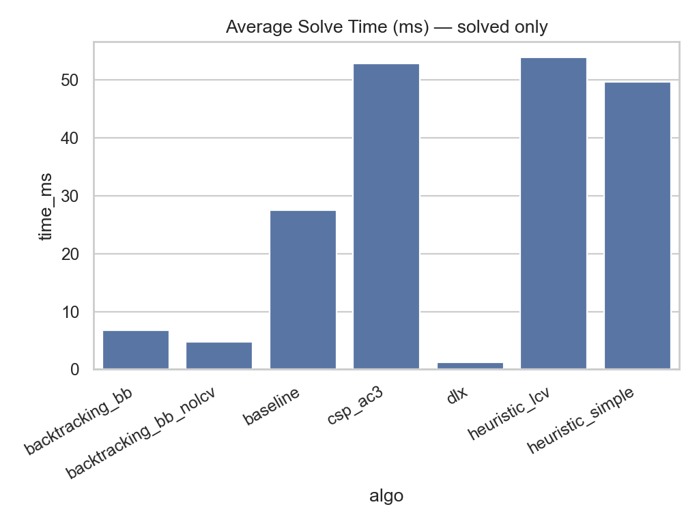
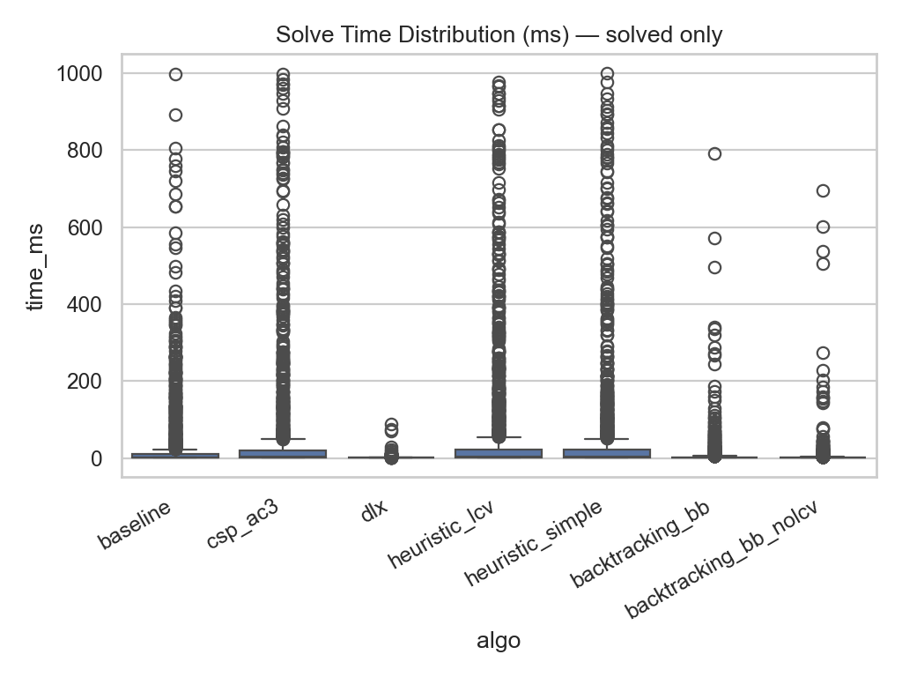
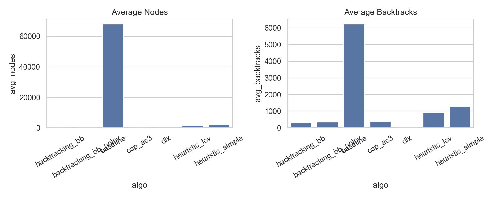
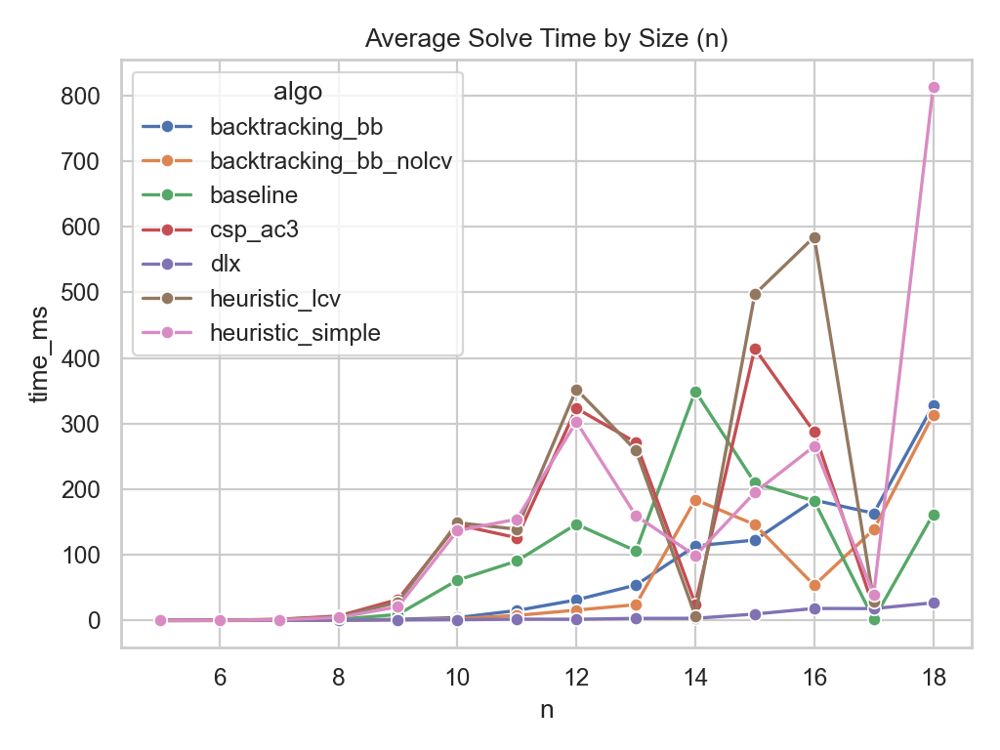
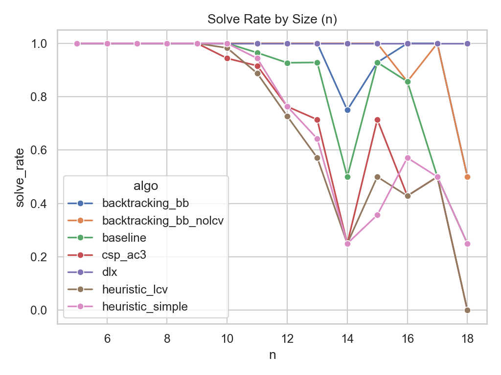

# Queens Data Science Report

- Source: `data/benchmarks/queens_runs.jsonl`
- Runs: 11326
- Unique puzzles: 3236
- Algorithms: dlx, backtracking_bb_nolcv, backtracking_bb, baseline, heuristic_simple, csp_ac3, heuristic_lcv

## Summary Table

| algo                  |   puzzles |   solved |   solved_rate |   avg_time_ms |   median_time_ms |   avg_nodes |   avg_backtracks |   timeout_rate |
|:----------------------|----------:|---------:|--------------:|--------------:|-----------------:|------------:|-----------------:|---------------:|
| dlx                   |      1618 |     1618 |        100    |       1.22142 |         0.719521 |     31.9382 |          23.3894 |           0    |
| backtracking_bb_nolcv |      1618 |     1615 |         99.81 |       4.75676 |         0.426083 |    373.069  |         364.537  |           0.19 |
| backtracking_bb       |      1618 |     1614 |         99.75 |       6.79902 |         0.645687 |    329.211  |         320.682  |           0.25 |
| baseline              |      1618 |     1600 |         98.89 |      27.5078  |         1.39544  |  67863.3    |        6218.11   |           1.11 |
| heuristic_simple      |      1618 |     1573 |         97.22 |      49.643   |         3.40267  |   2360.96   |        1291.91   |           2.78 |
| csp_ac3               |      1618 |     1560 |         96.42 |      52.9032  |         3.22504  |    398.697  |         390.295  |           3.58 |
| heuristic_lcv         |      1618 |     1558 |         96.29 |      53.9175  |         3.62556  |   1689.86   |         924.428  |           3.71 |

## Source Comparison (imported vs generated)

| source    |   runs |   puzzles |   solved |   solved_rate |   avg_time_ms |   median_time_ms |   avg_nodes |   avg_backtracks |   timeout_rate |
|:----------|-------:|----------:|---------:|--------------:|--------------:|-----------------:|------------:|-----------------:|---------------:|
| generated |   4102 |      1172 |     4085 |         99.59 |       24.177  |          0.58975 |     7832.19 |          1196.26 |           0.41 |
| imported  |   7224 |      2064 |     7053 |         97.63 |       29.8458 |          1.60692 |    12014.9  |          1458.63 |           2.37 |

## Source x Algo Breakdown

| source    | algo                  |   runs |   puzzles |   solved |   solved_rate |   avg_time_ms |   median_time_ms |   avg_nodes |   avg_backtracks |   timeout_rate |
|:----------|:----------------------|-------:|----------:|---------:|--------------:|--------------:|-----------------:|------------:|-----------------:|---------------:|
| generated | dlx                   |    586 |       586 |      586 |        100    |      0.610157 |         0.493125 |     11.3259 |          3.76109 |           0    |
| generated | backtracking_bb_nolcv |    586 |       586 |      586 |        100    |      0.719573 |         0.201896 |     72.1041 |         64.5392  |           0    |
| generated | backtracking_bb       |    586 |       586 |      586 |        100    |      1.15941  |         0.374687 |     68.6331 |         61.0683  |           0    |
| generated | baseline              |    586 |       586 |      586 |        100    |     20.059    |         0.800229 |  49284.5    |       5144.3     |           0    |
| generated | heuristic_simple      |    586 |       586 |      586 |        100    |     44.8937   |         2.01421  |   2687.43   |       1486.91    |           0    |
| generated | heuristic_lcv         |    586 |       586 |      582 |         99.32 |     49.8674   |         2.06269  |   1987.26   |       1092.98    |           0.68 |
| generated | csp_ac3               |    586 |       586 |      573 |         97.78 |     52.739    |         2.47483  |    511.721  |        504.211   |           2.22 |
| imported  | dlx                   |   1032 |      1032 |     1032 |        100    |      1.56852  |         0.896958 |     43.6424 |         34.5349  |           0    |
| imported  | backtracking_bb_nolcv |   1032 |      1032 |     1029 |         99.71 |      7.05588  |         0.640833 |    544.465  |        535.381   |           0.29 |
| imported  | backtracking_bb       |   1032 |      1032 |     1028 |         99.61 |     10.0138   |         0.969605 |    477.751  |        468.671   |           0.39 |
| imported  | baseline              |   1032 |      1032 |     1014 |         98.26 |     31.8125   |         1.81979  |  78600.1    |       6838.67    |           1.74 |
| imported  | heuristic_simple      |   1032 |      1032 |      987 |         95.64 |     52.4628   |         3.98762  |   2167.13   |       1176.13    |           4.36 |
| imported  | csp_ac3               |   1032 |      1032 |      987 |         95.64 |     52.9985   |         3.6355   |    333.081  |        324.161   |           4.36 |
| imported  | heuristic_lcv         |   1032 |      1032 |      976 |         94.57 |     56.3326   |         4.44263  |   1512.52   |        823.919   |           5.43 |

## Charts

